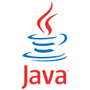

     
    

 

## Hello, my name is Willian!

 
I'm a FullStack developer, focused on Front-end, who is always looking for new challenges and learning.

 
My story as a programmer started at the age of 16, when I started my Technical course in Systems Development at SENAI. At the beginning of the course, I learned C# and Object Oriented Programming. The following year, I learned to use the SQL language to create and manipulate databases, and started my studies in WEB development. During this period, I learned HTML, CSS, JavaScript, Bootstrap and jQuery to carry out my Course Completion Work. In 2019, I started studying Computer Engineering at the Federal University of Espírito Santo, where I learned Python, C, C++, Java and Assembly. I'm currently finishing college and I'm learning ReactJS, NextJS, TypeScript, Docker and Git on my own in my spare time.

 

    
    &nbsp;
    
    &nbsp;
    

 

    

 

## Languages and Tools
    
 

<table align="center">
<thead>
  <tr>
    <th>Web development</th>
    <th>Desktop development</th>
    <th>Operational systems</th>
    <th>Database</th>
    <th>Infrastructure</th>
  </tr>
</thead>
<tbody>
  <tr align="center">
    <td></td>
    <td></td>
    <td></td>
    <td></td>
    <td></td>
  </tr>
  <tr align="center">
    <td></td>
    <td></td>
    <td></td>
    <td></td>
    <td></td>
  </tr>
  <tr align="center">
    <td></td>
    <td></td>
    <td></td>
    <td></td>
    <td></td>
  </tr>
  <tr align="center">
    <td></td>
    <td></td>
    <td></td>
    <td></td>
    <td></td>
  </tr>
  <tr align="center">
    <td></td>
    <td></td>
    <td></td>
    <td></td>
    <td></td>
  </tr>
  <tr align="center">
    <td></td>
    <td></td>
    <td></td>
    <td></td>
    <td></td>
  </tr>
  <tr align="center">
    <td></td>
    <td></td>
    <td></td>
    <td></td>
    <td></td>
  </tr>
  <tr align="center">
    <td></td>
    <td></td>
    <td></td>
    <td></td>
    <td></td>
  </tr>
  <tr align="center">
    <td></td>
    <td></td>
    <td></td>
    <td></td>
    <td></td>
  </tr>
</tbody>
</table>
